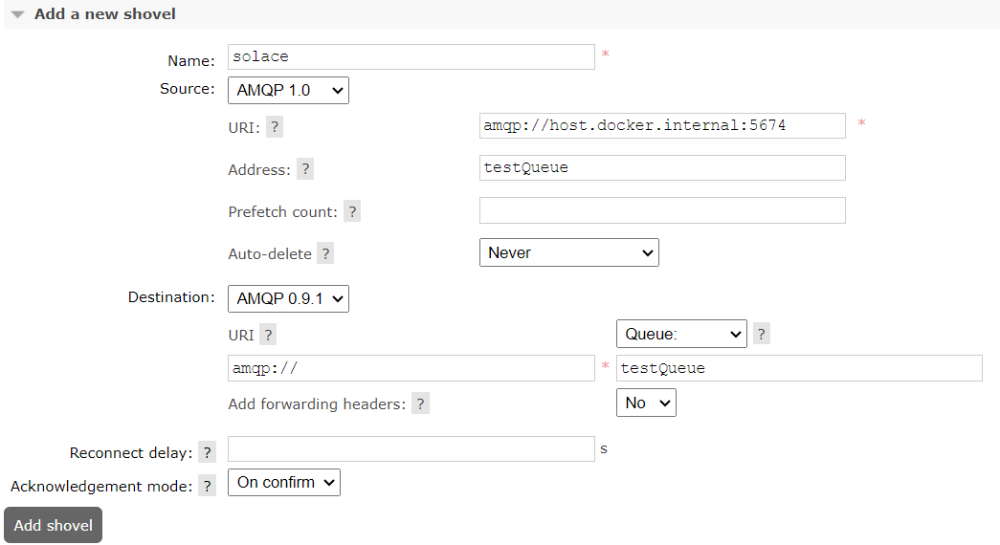

# Solace broker Prove of Concept

The PoC covers the following approaches to connect the Solace broker:

1. Using MassTransit transports such as RabbitMQ and ActiveMQ.
2. Using the RabbitMQ shovel plug-in to import messages from the Solace broker queue into RabbitMQ via the AMQP protocol.

The first approach using MassTransit is not possible. RabbitMQ and ActiveMQ transports are unable to connect to the Solace broker. The second approach is successful.

## Setup

To use this PoC, configure and run the Solace and RabbitMQ brokers. Then, use one of applications to verify PoC. The second apporach needs also to configure the shovel plugin.

### Brokers

Run Solace and RabbitMQ brokers by executing the following command in the root directory:

```powershell
docker compose up -d
```

### .NET Application client

Use the IDE of choice and open the solution file `src/SolacePoC.sln`.

For the first approach, run the `MassTransitPoC` project. This approach will not work because MassTransit does not support the Solace broker.

The second approach also uses a Solace .NET publisher and a shovel plugin installed in RabbitMQ. The producer publishes 100,000 messages to the Solace broker, and the plugin transfers them to RabbitMQ.

You can see produced messages in Solace UI management,  To do this, go to http://localhost:8080 (login and password `admin`) -> Messaging -> Message VPNs -> select `default` VPN -> Queues -> `testQueue` -> Messages Queued.

#### Shovel plugin

The shovel plugin is enabled by the docker compose. If you would like to enable it manually on another RabbitMQ instance, please visit [this site](https://www.rabbitmq.com/docs/shovel#getting-started) for instructions. To configure a shovel to move message from Solace to Rabbit MQ, please go to [Shovel Management](http://localhost:15672/#/dynamic-shovels) settings. Then, in the `Add a new shovel` section, configure the following options:

Name: solace

Source: AMQP 1.0
* URI: amqp://host.docker.internal:5674
* Address: testQueue

Destination: AMQP 0.9.1
* URI: amqp://
* Queue: testQueue



Then build and run the .NET `MessagePublisherPoC` project. Finally, check that 100,000 messages have been transferred to RabbitMQ in the `testQueue` queue on the default RabbitMQ vHost.
